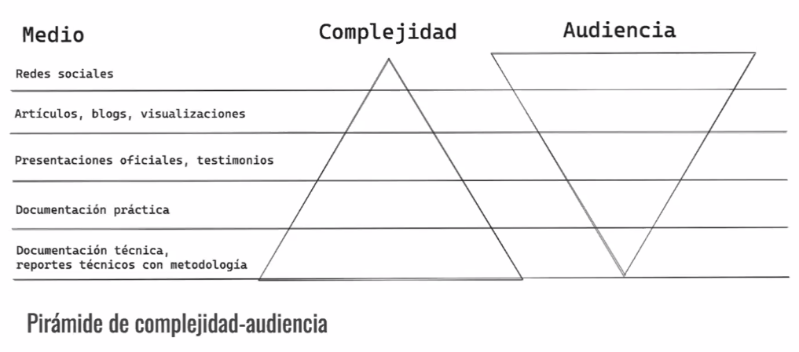

# Comunicación efectiva: audiencias no técnicas

# Agenda
* Entendiendo tu audiencia
* Simplificando conceptos complejos
* Uso efectivo de visuales
* Jerga y lenguaje
* Evitar errores comunes
* Interacción y retroalimentación
* Conclusión

# Entendiendo a tu audiencia

* Importancia de conocer a tu audiencia
    - Te permite adaptar tus métodos para ser lo más efectivo posible
    - Crear confianza y credibilidad
    - Fomentar participación y retroalimentación
    - Aprendizaje efectivo - para tu audiencia y para ti
    - Desarrollo profesional

* Pirámide de complejidad(Urban Institute)
    - Entre más complejidad menos audiencia se tiene   
    

    
    <em> Figura 1. Pirámide filosofía </em>

* Consejos para evaluar el nivel de conocimiento
    - Encuestas antes del 'evento'
    - Preguntas y respuestas al inicio del 'evento'
        + Del 1 al 10 que tanto les interesa apreder soble __x__ tema
        + ¿Qué tanto les interesa apreder sobre __x__ tema ?
    - Observar a tu audiencia - lenguaje corporal / digital
    - Hacer preguntas directas pero no intimidantes
        + ¿Qué les gustaría entender mejor sobre __x__? vs ¿Quién no entendió __x__ ?
    - Retroalimentación anónima
    - Comienza con conceptos básicos y construyes a partir de ahí

# Simplificando conceptos complejos

* Estrategias: Es escencial ser paciente y empático
    - Usar Analogías y metáforas
    - Evitar Jerga técnica
    - Ejemplos contretos y RELEVANTES
    - Utilizar visuales y diagramas
    - Historias y escenarios - PREVIAMENTE PLANEADOS
    - Enfocarse en 'unidades' - un proceso, un objeto, un concepto a la vez.
    - ⚠️Demostraciones⚠️

* Analogías y metáforas
    - Datos como ingredientes de cocina (limpíeza de datos)
    - Flujo de datos como ríos de agua (fuentes de datos)
    - Base de datos como biblioteca (estructura, indexación, acceso eficiente)
    - Minería de datos como búsqueda de tesoros
    - ETL como montaje de muebles
    - Big Data como un océano inmenso
    - Machine Learning como entrenamiento de mascotas
    - Algoritmos como recetas de cocina

* Visualizaciones y diagramas
    -😊😊

* Ejemplo 
    - ¿Cómo describirias la ingeniería de datos a alguien que no tiene mucha experiencia técnica? como un sistema en un biblioteca que te permite encontrar el libro que necesitas

* Tarea
    - Describe la ingeniería de datos a alguien que no tiene mucha experiencia técnica

# Errores comunes y como evitarlos

- Jerga técnica
- KISS -> Keep it simple stupid -> Keep ti simple, smartypants
- Perder los arboles por el bosque: Estás buscando arboles en un bosque
    + Es importante enfocarte en la meta y no perderse en los detalles
    + No todo lo que a ti te parezca interesante es importante
    + No todo lo que a ti no te parezca interesante no es importante
- Capturar pero no abrumar: Es importante capturar la atención de tu audiencia y es aún más importante no perderla 

# Interacción y retroalimentación
* Fomentar preguntas e interacciones
* Adapta tu enfoque
* Retroalimentación - pedirla y darla

# Conclusión

* Entiende a tu audiencia - quienes son y que quieren
* Todo debería simplificarse al mayor nivel posible, pero no más
* Usa visuales cuando puedas
* Utiliza el lenguaje de tu audiencia
* Enfocate en la meta
* Pide retroalimentación. Da retroalimentación
* Práctica